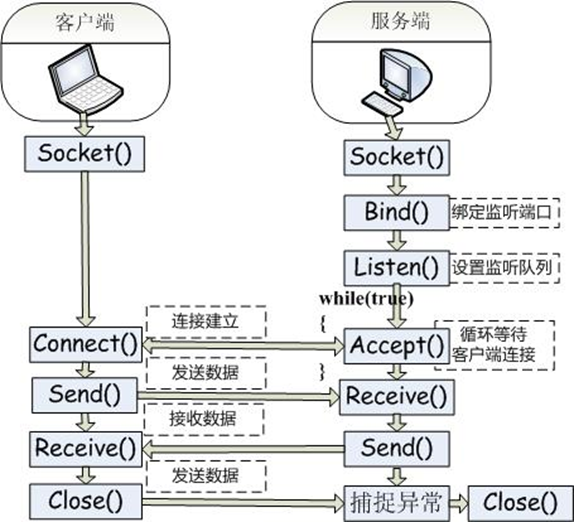

#  Intelligent_household

由C#编写基于Socket的大聪明家具模拟系统

## Scoket方法

#### 相关类

- lIPAddress类：包含了一个IP地址
- lIPEndPoint类：包含了一对IP地址和端口号

#### 方法

- Socket (): 创建一个Socket
- Bind(): 绑定一个本地的IP和端口号(IPEndPoint)，用于绑定 **IPEndPoint** 对象，在服务端使用。
- Listen(): 让Socket侦听传入的连接尝试，并指定侦听队列容量
- Connect(): 初始化与另一个Socket的连接，在客户端使用，用于连接服务端。
- Accept(): 接收连接并返回一个新的socket
- Send(): 输出数据到Socket
- Receive(): 从Socket中读取数据
- Close(): 关闭Socket (销毁连接)

## 单元级项目

### 发送和接收 TCP 数据包

1. TCP 数据包结构设计 
2. TCP 数据包发送和接收过程

### TCP客户端构建流程

1.创建socket
2.链接服务器
3.接收数据
4.关闭套接字

### 功能模块

空调温度，模式的远程控制

## 系统级项目

大聪明家居

客户端——发送操作指令

服务端——解析操作指令，向设备端发送命令

设备端——接受并执行命令

### 功能模块

1. 开关灯
2. 拉窗帘
3. 电饭煲
4. 空调
6. 插排
7. 热水器

### 数据编码方式

#### 客户端传输信息方式

设备名+':OP'+操作标识码+（其他）

例： 调整空调温度为25`AirCondition:OP225`

操作标识码

- 0 - 关闭设备
- 1 - 打开设备
- 2 - 调整设备温度
- ...

#### 服务端传输信息方式

1. ##### 操作

设备名 + ':OP '+ 操作标识码 +（其他）

例： 调整空调温度为25`AirCondition:OP225`

操作标识码

- 0 - 关闭设备
- 1 - 打开设备
- 2 - 调整设备温度
- ...

2. ##### 请求身份

向设备端发送 `check` ，返回‘Name-’ + 设备名

#### 设备端传输信息方式

##### 返回设备身份

接收到`check`时返回‘Name-’ + 设备名

### 变量说明

`sockets` 存储设备名到`socket`的映射

`socketNames` 存储`socket`到设备名的映射

### 技术点

使用SunnyUI框架搭建界面，令界面更加美观，从而提高用户使用体验

使用VS发布功能将程序打包上传至服务器，令服务端在服务器上运行

[C#控制台程序如何发布到服务器Linux上运行 - 编程 - 中国红客联盟 - Powered by Discuz! (chinesehongker.com)](https://www.chinesehongker.com/portal.php?mod=view&aid=3225)

### 运行报错处理方法

如出现下图错误

导入SunnyUI包即可

右键项目，点击管理NuGet程序包

点击`浏览`选项卡

在搜索框中输入sunnyui

点击第一个搜索结果后右侧选择安装即可

完成上述操作后关闭报错页面，重新生成解决方案再打开就好啦

